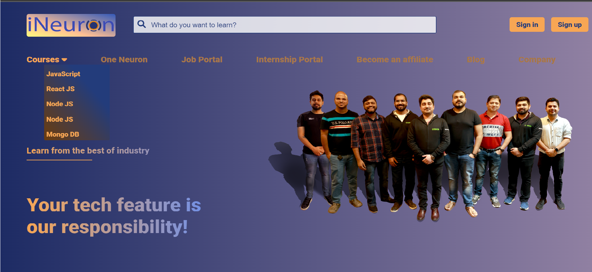
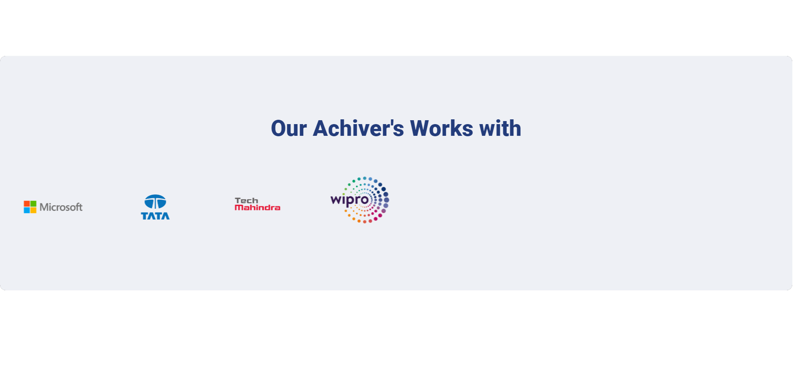
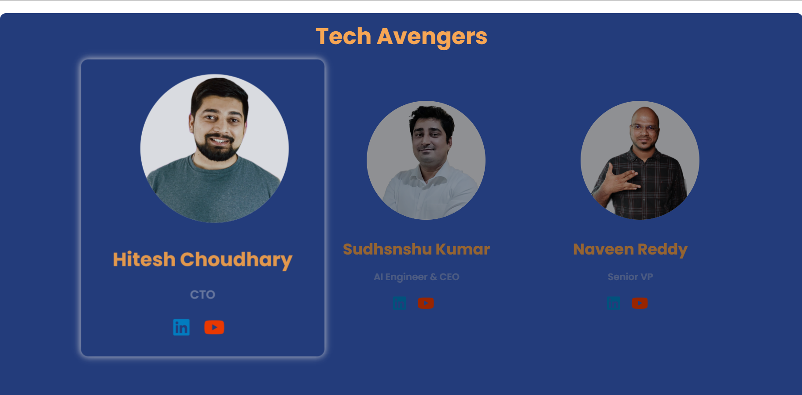
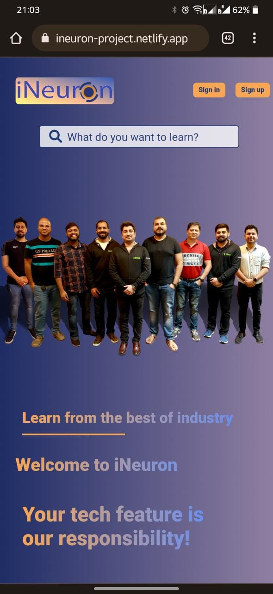
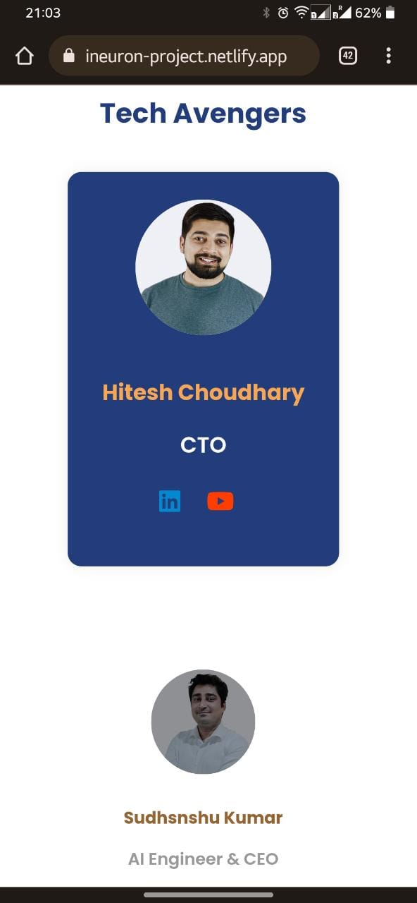
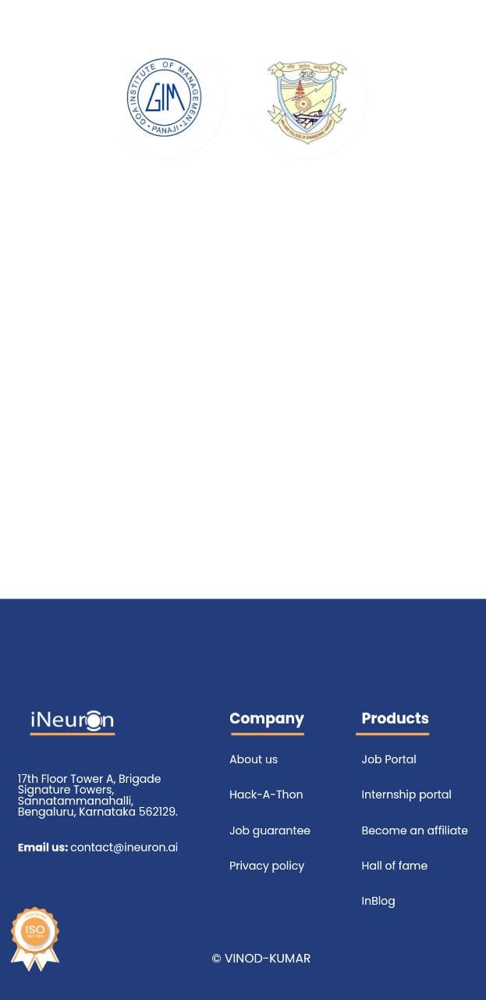

# iNeuron-Hackathon Project


[Live link Hackathon Project](https://ineuron-project.netlify.app/)

>  Technology & features used for this project
```
 I haveused technologies in this project like    HTML, CSS and bit of Java Script.
-   I have used features in this project Animations, linear-gradient colors, Card hover effects Home page image landing delay and Type writer using ::pseudo class, etc...
```


## Duration of complete this project

-   Approx 3 days taken to complete this project and I am working as fulltime employee in non iT and I am working between night 7:30 to 11:00 PM.
-   Now I am fully confidenced to build any websites.

## **The website same as below image for desktop's**





## **The website same as below image for Mobiles**






---
> __Thank You to Mr. Hitesh Choudhary Sir for giving me this opportunity to participate in live Hackathon__